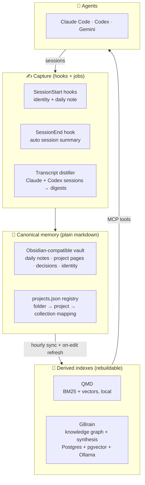

<div align="center">

# 🧠 SOS Memory

**Durable, self-hosted memory for AI coding agents.**

Give Claude Code, Codex, and Gemini a shared brain that survives every session —
built on plain markdown you own, indexed by local search and a local knowledge
graph, kept fresh by hooks and scheduled jobs. No SaaS. No API bills for
retrieval. Your machine, your models, your data.

[](https://nodejs.org)
[](LICENSE)
[](#cross-platform)
[](#agent-integration)

</div>

---

## Why this exists

AI coding agents are brilliant for one session and amnesiac the next. Every
conversation re-explains who you are, what your projects look like, and what
you decided last Tuesday. Cloud "memory" features lock that context into
someone else's product.

SOS Memory takes the opposite bet: **your memory is a folder of markdown files
on hardware you control**. Agents write to it automatically, search it locally,
and load the right slice of it at session start. If you delete every index, you
lose nothing — everything rebuilds from the markdown in minutes.

```
You close your laptop mid-project.
Tomorrow, any agent — Claude Code, Codex — opens with:
  who you are · what this project is · what happened yesterday ·
  what you decided and why · what to do next
No prompting. No copy-paste. No cloud.
```

## How it works

Three layers, one invariant: **markdown is canonical, everything else is a
derived, rebuildable index.**



### 1. Capture — memory writes itself

| Hook / job | Trigger | What it does |
|---|---|---|
| `vault-identity` | Session start | Injects your identity, the resolved project's README excerpt, and today's progress into the agent's context |
| `vault-daily` | Session start | Creates/extends today's daily note with a section per project; detects unregistered project folders |
| `vault-autosave` | Session end | Spawns a headless agent that appends a 3–6 bullet session summary + **Next** action to the daily note |
| `transcript-distiller` | Hourly (scheduled) | Finds *finished* Claude Code and Codex sessions, distills each into a digest via a small headless model, files it under the right project. Never backfills history; loop-guarded so it can't distill itself |
| `qmd-refresh` | After file edits | Refreshes the touched project's search collection in the background |
| `action-log` | After file edits | Appends an audit line to `00-Inbox/AI-ACTION-LOG.md` for every agent write under your documents root |
| `gbrain-sync` | Hourly (scheduled) | Imports every registered project folder into the knowledge brain (hash-based incremental) |
| `sos-health-check` | After memory-sensitive edits | Repairs registry/vault/index drift, throttled |

Which project a note belongs to is resolved by **longest-path match** against
the registry — work in `~/Documents/03-Bayan-AI/rag/`, and your notes file under
the Bayan project automatically.

### 2. Canonical store — markdown you own

- **Vault** — an Obsidian-compatible folder: `Daily/` session logs, `Projects/`
  one page per venture, `Context/me.md` identity, decision records. Edit it by
  hand, sync it with git, read it in any editor. It *is* the database.
- **Registry** — `projects.json` maps top-level folders to projects, search
  collections, and daily-note sections. One file describes your whole world;
  every hook and job derives its behavior from it.

### 3. Retrieval — two engines, routed by question type

| Question | Engine | Why |
|---|---|---|
| "Find the note where we decided X" | **QMD** — local BM25 + vector search | Exact names, titles, IDs, keywords — fast lexical + semantic lookup |
| "What do we know about this client across meetings and proposals?" | **GBrain** — local knowledge graph + LLM synthesis | Multi-hop gather across pages, cited answer, explicit gap analysis |
| "What changed in this project since last month?" | **GBrain** — timeline / trajectory | Temporal reasoning over the graph |
| "Who is connected to this company?" | **GBrain** — graph traversal | Typed links, backlinks |
| "Where is this function defined?" | ripgrep | Indexes are for memory, not code |

Both engines run **entirely on your machine**:

- **[QMD](https://github.com/tobi/qmd)** — zero-config local search (BM25 +
  embeddings) over your markdown collections.
- **[GBrain](https://github.com/garrytan/gbrain)** — a personal knowledge brain
  on **PostgreSQL 17 + pgvector**, embedding with **Ollama**
  (`nomic-embed-text`), synthesizing with local chat models (e.g.
  `qwen3:14b` for interactive answers, `qwen3:4b` for background enrichment —
  sized automatically to your RAM). A nightly "dream cycle" deduplicates,
  links, and consolidates — capped by a watchdog so it can never run away with
  your RAM.

Agents reach both through **MCP**, with routing rules injected into their
instruction files so each question type lands on the right engine.

## Quickstart

```bash
git clone https://github.com/Sohaibsajid50/sos-memory.git
cd sos-memory
npm test                          # zero dependencies — Node ≥18 is all you need

node bin/sos.js install           # hooks, skills, adapters, registry (interactive)
node bin/sos.js apply             # detects your machine, writes ~/.sos/sos.config.json,
                                  # prints the provisioning plan (QMD, Postgres, Ollama, GBrain),
                                  # installs scheduled jobs + MCP wiring
node bin/sos.js doctor            # verify everything, including the sneaky failure modes
```

`apply` is **idempotent and config-driven**: one answers file
(`~/.sos/sos.config.json`) describes your setup; re-running regenerates jobs,
GBrain config, and MCP registrations to match. Edit the file, `apply` again.

> **Agent-native onboarding (in progress):** the goal is that you clone this
> repo, open your agent inside it, and say *"set me up"* — the agent interviews
> you (what you do, which projects, which models fit your RAM), writes the
> config, runs `apply`, and verifies with `doctor`. See [Roadmap](#roadmap).

### Use as a Claude Code / Codex plugin

The repo is dual-shaped — a plugin *and* a CLI:

```bash
claude --plugin-dir /path/to/sos-memory
```

```text
/sos-memory:sos-health      /sos-memory:sos-install     /sos-memory:sos-validate
/sos-memory:sos-bootstrap-project <folder>
/sos-memory:sos-update-qmd  /sos-memory:sos-embed
```

Codex hosts use `.codex-plugin/plugin.json` with the same `skills/` and `hooks/`.

## Under the hood

| Concern | Technology |
|---|---|
| Toolkit / CLI / hooks | Node.js ≥18, **zero runtime dependencies** |
| Canonical store | Plain markdown (Obsidian-compatible) + one JSON registry |
| Lexical + vector search | QMD (local BM25 + embeddings) |
| Knowledge graph + synthesis | GBrain on PostgreSQL 17 + pgvector |
| Local models | Ollama — `nomic-embed-text` embeddings; chat models auto-sized to RAM |
| Agent integration | MCP servers + lifecycle hooks (Claude Code), config + AGENTS.md (Codex), GEMINI.md adapter |
| Scheduling | launchd (macOS) · systemd user timers (Linux) · cron (fallback) · Task Scheduler guidance (Windows) |
| Session digestion | Headless `claude -p` with a small model, lean flags, loop guards |

### Battle-tested defaults

Every default in this toolkit encodes a real failure from the reference
deployment — so you don't have to rediscover them (full war stories in
[`references/gbrain-setup.md`](references/gbrain-setup.md)):

- **Postgres over PGLite** — PGLite is single-writer; two concurrent agent
  sessions deadlock the brain. `sos doctor` flags it.
- **Split models by role** — interactive synthesis on the big model, nightly
  enrichment on a small one, with a **2-hour watchdog**: a first full dream
  cycle once ran 13 hours and pinned 13 GB of RAM. Never again.
- **Verify model pulls with `ollama list`** — `ollama pull` can fail silently
  on network resets and still exit 0.
- **macOS privacy (TCC) awareness** — scheduled jobs run outside your
  terminal's permissions; a denied "Node wants to access Documents" pop-up
  becomes silent write failures. Setup warns you *before* the pop-ups appear;
  `doctor` surfaces the evidence if something was denied.
- **File-plane vs DB-plane config** — the one GBrain setting that must be
  written to `~/.gbrain/config.json` directly is handled for you.

## CLI reference

```bash
sos install [--dry-run|--auto|--yes]   # hooks, skills, adapters into ~/.claude
sos apply [--dry-run]                  # materialize config: jobs, gbrain, MCP
sos doctor                             # full-system verification
sos platform                           # what machine am I on? (JSON)
sos health-check [--repair]            # registry/vault/QMD drift repair
sos bootstrap-project <folder>         # register a project + collection + vault page
sos update-qmd | sos embed             # index maintenance
sos audit-vault | sos continues | sos validate | sos update
```

## Cross-platform

macOS and Linux are first-class (laptop or VPS — a headless Linux box defaults
to the `vps` profile). Windows detection and Task Scheduler command generation
ship today; native Windows job installation is on the roadmap. Everything else
— hooks, CLI, registry, retrieval — is plain Node and runs anywhere Node does.

## Design principles

1. **Markdown is canonical; indexes are cattle.** Blow away Postgres, QMD, all
   of it — one command rebuilds from the vault.
2. **The repo is the installer, never the data.** `git pull` upgrades your
   system without touching your memory.
3. **Local-first, model-agnostic.** Swap the synthesis model, the embedding
   model, or the agent CLI without rearchitecting.
4. **Capture must be automatic.** Memory that depends on remembering to save
   isn't memory.
5. **Every incident becomes a doctor check.** The deployment that built this
   toolkit debugged the failure modes so `sos doctor` can catch them in yours.

## Roadmap

- [x] **M1** — portable hooks, cross-platform scheduler, GBrain layer,
  config-driven `apply`, incident-encoding `doctor`
- [ ] **M2** — agent-native onboarding: clone → *"set me up"* → guided
  interview → running system in one conversation
- [ ] **M3** — VPS profile: docker-compose (Postgres, Ollama, GBrain HTTP),
  team/client deployments
- [ ] **M4** — plugin marketplace distribution, demo, public beta

## License

MIT

---

<div align="center">
<sub>Built in the open as part of <b>Own Your Stack</b> — real, revenue-generating AI on a stack you own.</sub>
</div>
